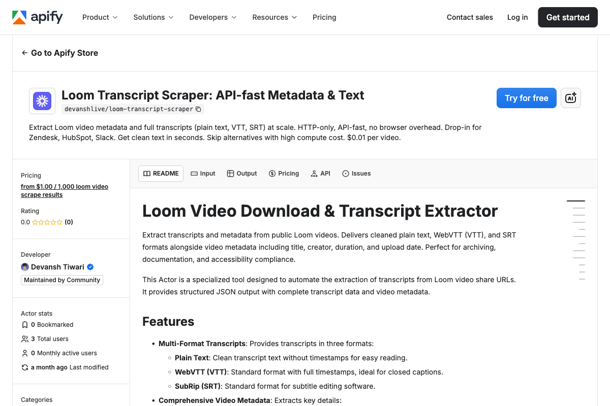

<div align="center">

# Loom Transcript Scraper: Video Text as JSON

[](https://apify.com/devanshlive/loom-transcript-scraper)
[](https://nodejs.org/)
[](https://github.com/getascraper)
[](https://github.com/getascraper/how-to-scrape-loom-transcripts)

**Extract transcripts and metadata from public Loom videos into structured JSON with VTT and SRT support in seconds.**

Built for content teams, accessibility specialists, and developers who need searchable video transcripts without manual transcription.

[Quick Start](#quick-start) · [API Reference](#api-reference) · [Pricing](#pricing) · [Support](#support)



</div>

---

## Quick Start

```javascript
import { ApifyClient } from 'apify-client';
import 'dotenv/config';

const client = new ApifyClient({ token: process.env.APIFY_TOKEN });

const run = await client.actor('devanshlive/loom-transcript-scraper').call({
  startUrls: [
    { url: 'https://www.loom.com/share/912e89a68ccc42c5ab5096fec7cd63d6' },
  ],
});

const { items } = await client.dataset(run.defaultDatasetId).listItems();
console.log(items);
```

**Output:**
```json
{
  "loomId": "912e89a68ccc42c5ab5096fec7cd63d6",
  "url": "https://www.loom.com/share/912e89a68ccc42c5ab5096fec7cd63d6",
  "title": "Product Demo Q1 2024",
  "creator": "Jane Smith",
  "uploadDateISO8601": "2024-01-15T10:30:00Z",
  "uploadDate": "2024-01-15",
  "durationISO8601": "PT15M30S",
  "transcript": "Welcome to our product demo...",
  "transcriptVTT": "WEBVTT\n\n00:00:00.000 --> 00:00:05.000\nWelcome to our product demo...",
  "transcriptSRT": "1\n00:00:00,000 --> 00:00:05,000\nWelcome to our product demo..."
}
```

---

## Features

- **Native transcript extraction** from Loom's API (no speech-to-text)
- **VTT and SRT formats** for subtitle editing and video players
- **Clean plain text** without timestamps for NLP pipelines
- **Video metadata** including title, creator, duration, and upload date
- **Batch processing** for multiple Loom URLs in one run

---

## What this actor does

This Actor extracts transcripts and metadata from public Loom videos. It uses Loom's native API to retrieve transcripts, supporting VTT, SRT, and plain text formats.

It processes multiple video URLs in a single run, returning structured JSON with transcripts, metadata, and error handling for failed extractions.

---

## Installation

```bash
npm install
```

Copy the environment file and add your Apify API token:

```bash
cp .env.example .env
```

Open `.env` and replace `your_apify_token_here` with your actual Apify API token. Get one free at [console.apify.com](https://console.apify.com/settings/integrations).

---

## Input

| Field | Type | Description | Default |
|-------|------|-------------|---------|
| `startUrls` | array | Loom video URLs to process | none |
| `maxVideos` | integer | Max videos to process | 100 |

---

## Output

Each video is a structured JSON record with transcript data. Download as JSON, CSV, Excel, or HTML.

| Field | Description |
|-------|-------------|
| `loomId` | Loom video ID (32-character hex string) |
| `url` | Full Loom share URL |
| `title` | Video title as set by the creator |
| `creator` | Display name of the video creator |
| `uploadDateISO8601` | Upload timestamp in ISO 8601 format |
| `uploadDate` | Upload date (YYYY-MM-DD) |
| `durationISO8601` | Video duration in ISO 8601 format |
| `transcript` | Clean transcript text without timestamps |
| `transcriptVTT` | WebVTT format with full timestamps |
| `transcriptSRT` | SubRip format for subtitle editing |
| `error` | Error message if transcript extraction failed |

See `sample-output.json` for a full example.

---

## Pricing

**$0.001 per video.**

A run of 100 videos typically completes in 1 to 2 minutes. Pay only for what you extract.

---

## Use Cases

- **Accessibility compliance:** Generate transcripts for video content
- **Documentation:** Archive Loom video transcripts for knowledge bases
- **Content analysis:** Extract text from Loom videos for NLP pipelines
- **Meeting notes:** Convert Loom recordings into searchable text

---

## FAQ

**Do I need speech-to-text?**
No. The Actor extracts native transcripts from Loom's API. No transcription is performed.

**What formats are supported?**
Plain text, WebVTT (VTT), and SubRip (SRT) formats are all included in the output.

**Can I process private videos?**
No. Only public Loom videos are supported. The video must be accessible without authentication.

---

## Support

Open an issue in the [Apify Console](https://console.apify.com/actors/devanshlive~loom-transcript-scraper/issues).

---

## Related Resources

- [Loom API documentation](https://dev.loom.com/)
- [Apify Client for JavaScript](https://docs.apify.com/api/client/js/)

---

**Ready to start extracting?**

[Open the Loom Transcript Scraper on Apify](https://apify.com/devanshlive/loom-transcript-scraper)
